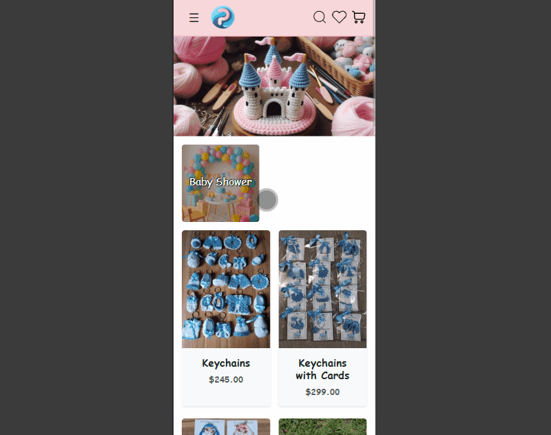

# Princess Castle (Online store of children's goods)

Princess Castle is a full-stack e-commerce platform that I developed for a small company to establish their online presence and begin selling products. This project served a dual purpose: delivering a real-world business solution while also acting as a comprehensive showcase of my web development skills. The entire deployment process is automated through a CI/CD pipeline using GitHub Actions. It provides a complete customer journey, from browsing a multilingual product catalog to a streamlined checkout process designed to handle manual payment confirmations, demonstrating a feature-rich application ready for a production environment.

## 📸 Demo

  

## ✨ Key Features

* **👤 User Account System**: Full user authentication with login or email/password and social login options (Google, Facebook, Twitter), plus personal accounts with detailed order history.
* **🛒 E-commerce Flow**: A complete shopping cart system and a flexible coupon/discount system.
* **⭐ Social & Engagement**: Users can "like" products, leave comments, and give ratings to items they've purchased.
* **🔍 Product Discovery**: Advanced product search and a "Similar Products" recommendation section.
* **📱 Fully Responsive Design**: Seamless experience on desktop, tablet, and mobile devices.
* **🌍 Internationalization (i18n)**: Full support for multiple languages, including:
  - 🇬🇧 English
  - 🇪🇸 Spanish
  - 🇷🇺 Russian

## 🛠️ Tech Stack

| Category | Technologies |
| :--- | :--- |
| **Backend** | `Python 3.12` `Django 5.0.7` `Django REST Framework` `Celery` `RabbitMQ` `Redis` `OAuth 2.0` |
| **Frontend** | `Bootstrap 5` `Django Templates` `HTML5` `CSS3` `JavaScript` |
| **Database** | `PostgreSQL` |
| **Deploy & Infrastructure** | `AWS (EC2, S3, RDS)` `Nginx` `uWSGI` `Docker` `Cloudflare` |
| **CI/CD** | `GitHub Actions` `AWS SSM` |
| **Testing** | `Unittest` |
| **Asset Optimization** | `ImageKit` |

## 🏆 Project Highlights & Engineering Decisions

This section details some of the key technical decisions and implementations that go beyond standard features, showcasing the project's robustness, security, and performance.

### 🚀 Performance Optimization
During development, I actively used the `django-debug-toolbar` to analyze and profile database performance. This allowed me to identify and resolve several N+1 query problems by refactoring Django ORM queries with `select_related` and `prefetch_related`, significantly improving page load times.

### 🛡️ Security & Infrastructure
The project is managed through Cloudflare, where I have configured a multi-layered security approach:
* **DNS & CDN:** Leveraged Cloudflare's global CDN for fast content delivery.
* **WAF & Firewall Rules:** Implemented custom firewall rules to block threats.
* **Bot Management:** Configured rules to manage bot traffic, allowing legitimate crawlers while blocking malicious ones.
* **Spam Protection:** Integrated Cloudflare Turnstile as a user-friendly alternative to CAPTCHA.

### 📈 SEO Optimization
To improve the site's visibility for search engines, several SEO best practices were implemented:
* **Dynamic Sitemap:** A `sitemap.xml` is automatically generated via Django's sitemaps framework.
* **Monitoring & Analytics:** The website is integrated with Google Search Console to monitor indexing status and track search performance.

### 💳 Payment System Evolution
Initially, the project was developed with Stripe and Conekta API integrations. Due to the client's specific business and regulatory requirements, the system was ultimately adapted to a robust process that handles orders with manual payment confirmation. This demonstrates adaptability in delivering technical solutions based on real-world business constraints.

## 📄 License

The project is distributed under the MIT license. For more details, see the [LICENSE](LICENSE) file.

## 👤 Contacts

* **LinkedIn**: [https://www.linkedin.com/in/aleksandr-syrenskii](https://www.linkedin.com/in/aleksandr-syrenskii)
* **Email**: alexander.syrenskiy@gmail.com
